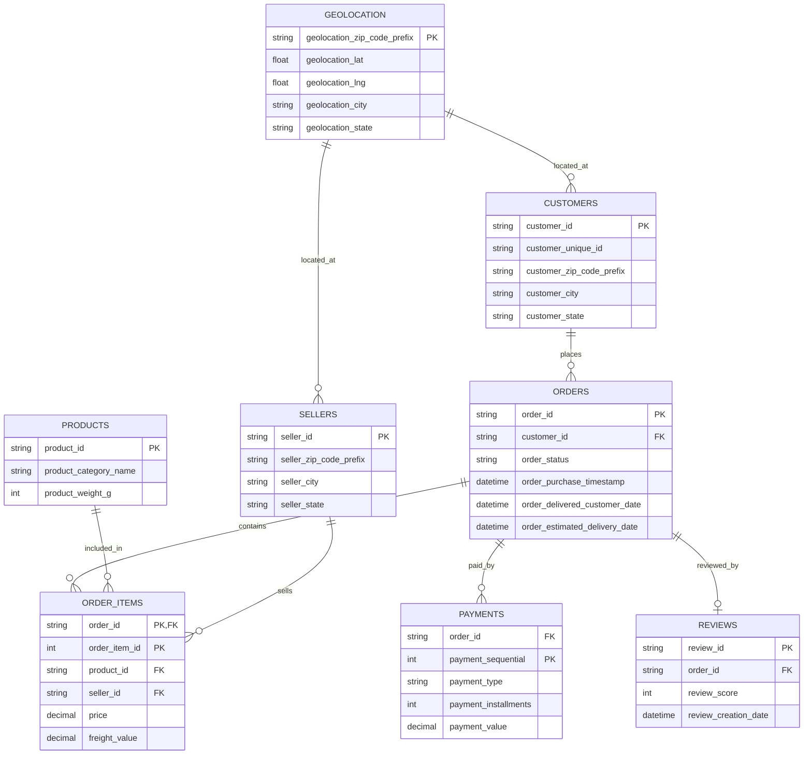

```mermaid
erDiagram
    CUSTOMERS ||--o{ ORDERS : places
    ORDERS ||--o{ ORDER_ITEMS : contains
    PRODUCTS ||--o{ ORDER_ITEMS : included_in
    SELLERS ||--o{ ORDER_ITEMS : sells
    ORDERS ||--o{ PAYMENTS : paid_by
    ORDERS ||--o| REVIEWS : reviewed_by

    GEOLOCATION ||--o{ CUSTOMERS : located_at
    GEOLOCATION ||--o{ SELLERS : located_at

    CUSTOMERS {
        string customer_id PK
        string customer_unique_id
        string customer_zip_code_prefix
        string customer_city
        string customer_state
    }

    ORDERS {
        string order_id PK
        string customer_id FK
        string order_status
        datetime order_purchase_timestamp
        datetime order_delivered_customer_date
        datetime order_estimated_delivery_date
    }

    ORDER_ITEMS {
        string order_id PK, FK
        int order_item_id PK
        string product_id FK
        string seller_id FK
        decimal price
        decimal freight_value
    }

    PRODUCTS {
        string product_id PK
        string product_category_name
        int product_weight_g
    }

    SELLERS {
        string seller_id PK
        string seller_zip_code_prefix
        string seller_city
        string seller_state
    }

    PAYMENTS {
        string order_id FK
        int payment_sequential PK
        string payment_type
        int payment_installments
        decimal payment_value
    }

    REVIEWS {
        string review_id PK
        string order_id FK
        int review_score
        datetime review_creation_date
    }

    GEOLOCATION {
        string geolocation_zip_code_prefix PK
        float geolocation_lat
        float geolocation_lng
        string geolocation_city
        string geolocation_state
    }
```
